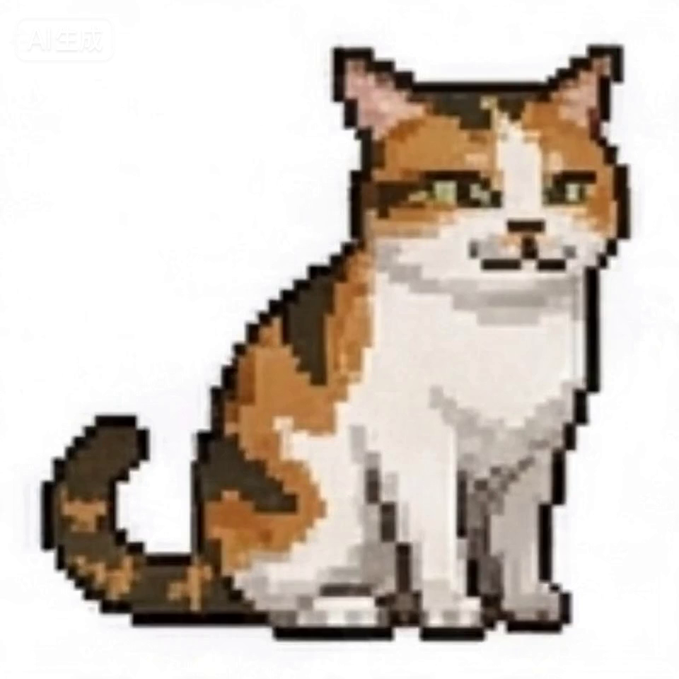

# Desktop Neko



Desktop Neko is a delightful, cross-platform virtual desktop pet application written in Rust using the [Slint](https://slint.dev) UI framework. Inspired by the classic virtual pets of the late 90s and early 2000s, Desktop Neko brings a lively companion to your modern desktop that walks, sleeps, and reacts to your interactions.

## Features

- **Cross-Platform Compatibility**: Fully supported on Windows and macOS.
- **Customizable State Machine**: Define your pet's behaviors via a simple `behaviors.toml` configuration file. Easily construct full state machines with complex animation transition logic, randomly weighted actions, timers, and edge collision detection.
- **DPI-Aware Transparency**: Smooth, pixel-perfect rendering using physical pixels ensuring that your pet looks sharp and correctly scaled across multiple monitor setups.
- **Multiple Pets**: Spawn as many pets as you'd like simultaneously via the system tray.
- **Drop-in Packages**: Easily create and test new pets by configuring a simple folder with standard sprite sheets and `.toml` manifests.

## Installation

You can grab the latest bundled binary for your platform from the [Releases](../../releases) page! 

- **macOS**: Download the `.dmg`, open it, and drag `Desktop Neko.app` to your Applications folder.
- **Windows**: Download the `.zip`, extract the files, and launch `desktop-neko.exe`.

*Note: The executable expects the `packages/` directory to exist alongside it to load pet assets correctly.*

## Building from Source

To build Desktop Neko from source, ensure you have the [Rust toolchain](https://rustup.rs/) installed.

```bash
# Clone the repository
git clone https://github.com/supermartian/desktop-neko.git
cd desktop-neko

# Run directly using Cargo
cargo run --release
```

## Adding Custom Animations & Transitions

Desktop Neko's `custom_pet` package operates on simple sprite sheets (like `alert.png`, `idle.png`, `walk_right.png`).

To create custom transition animations (e.g. your pet getting up before walking):
1. Add the sprite sheet to `packages/<pet_name>/sprites/`.
2. Register the animation details (width, height, frames, fps) in `packages/<pet_name>/manifest.toml`.
3. Create a state block in `packages/<pet_name>/behaviors.toml` and use the built in `condition = { type = "animation_done" }` to advance immediately after the one-shot animation completes!

## License

This project is licensed under the MIT License - see the [LICENSE](LICENSE) file for details.
